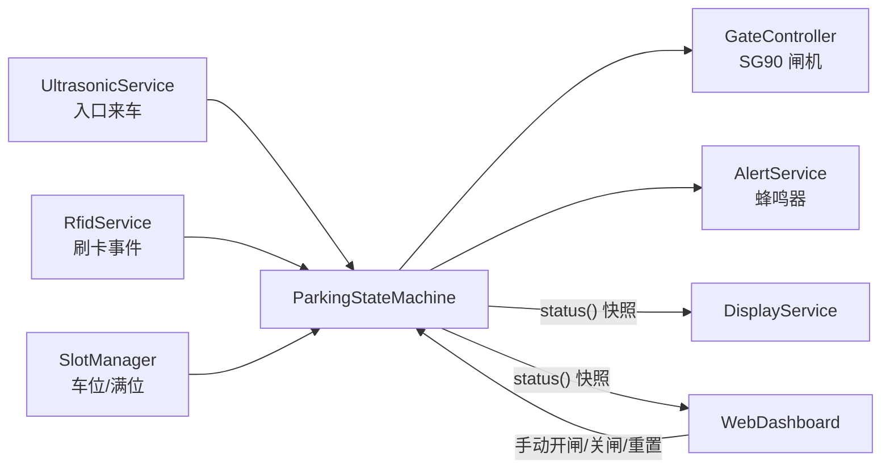
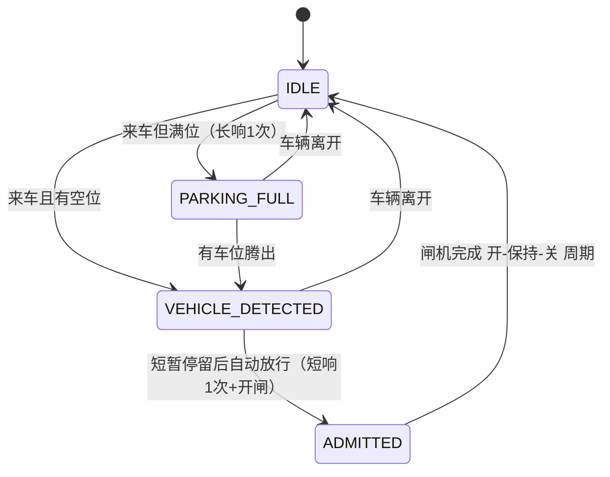

# 软件架构

## 设计原则

- `parking-system.ino` 只做初始化与调度，不写业务逻辑
- 每个硬件/功能一个模块（类），单一职责，便于答辩讲解与维护
- 全部 `millis()` 非阻塞调度，主循环无长 `delay()`
- GPIO 唯一来源 `config/Pins.h`，参数唯一来源 `config/Settings.h`
- 任一 `ENABLE_*` 功能开关关闭后仍可编译（条件编译退化为空实现）

## 模块职责

| 模块 | 文件（src/） | 职责 |
| --- | --- | --- |
| `ParkingStateMachine` | ParkingStateMachine.h/.cpp | 主业务状态机：串联来车检测→刷卡→开闸→复位全流程 |
| `GateController` | GateController.h/.cpp | SG90 舵机闸机：开/关/计时推进/到时自动关闸 |
| `RfidService` | RfidService.h/.cpp | RC522 读卡、UID 格式化、白名单判断、产生刷卡事件 |
| `UltrasonicService` | UltrasonicService.h/.cpp | HC-SR04 测距、滞回+连续确认的"入口有车"判定 |
| `SlotManager` | SlotManager.h/.cpp | 2~4 路红外车位去抖、total/occupied/free 统计、满位判断 |
| `DisplayService` | DisplayService.h/.cpp | OLED SSD1306 状态显示 |
| `AlertService` | AlertService.h/.cpp | 蜂鸣器节奏（成功 1 短 / 无效 3 短 / 满位 1 长 / 报警循环预留） |
| `WebDashboard` | WebDashboard.h/.cpp | Wi-Fi（STA + AP 兜底）、网页仪表盘、JSON API、手动控制 |
| `ParkingTypes` | ParkingTypes.h | 共享枚举（GateState/EntryState/AlertPattern）与状态快照结构 |

## 数据流



输入模块只产出事实（距离、事件、车位状态），决策集中在状态机，
OLED 和 Web 是只读消费者（Web 的手动控制经状态机转发，不直接操作舵机）。

## 主状态机

默认流程（无刷卡，`ENABLE_RFID=0`）：



同一辆车在 `ADMITTED` 完成后被标记为已放行，需先驶离入口（超声波重新判定为空）
才会再次触发放行，避免车停在传感器前导致连续开闸。

启用刷卡（`ENABLE_RFID=1`）时，在 `VEHICLE_DETECTED` 之后插入 `WAITING_FOR_CARD`：
合法卡 → `ADMITTED`，非法卡 → `CARD_REJECTED`（短响 3 次，车辆仍在可重刷），
等待超时或车辆离开回 `IDLE`。

闸机自身另有四态子状态：`CLOSED → OPENING → OPEN → CLOSING → CLOSED`，
SG90 无位置反馈，OPENING/CLOSING 按 `GATE_MOTION_TIME_MS` 计时推进，
OPEN 保持 `GATE_OPEN_HOLD_MS` 后自动关闸。

## 主循环调度顺序

```
loop():
  now = millis()
  1. 输入采集   ultrasonic.update / rfid.update / slots.update
  2. 业务决策   parkingSm.update
  3. 执行输出   gate.update / alerts.update / display.update / web.update
```

唯一的已知阻塞点：HC-SR04 的 `pulseIn`，已设 `ULTRASONIC_TIMEOUT_US`
（25ms 上限，每 100ms 采样一次），对 50Hz 舵机和 Web 响应无感知影响；
Phase 2 如需更高实时性可改中断方案。

## 目录结构

```
firmware/parking-system/
├── parking-system.ino      # 仅初始化 + 调度
├── config/
│   ├── Pins.h              # 全部 GPIO（唯一来源）
│   ├── Settings.h          # 全部参数与功能开关（唯一来源）
│   └── WifiCredentials.example.h   # Wi-Fi 凭据模板（真实文件被 git 忽略）
├── src/                    # 各功能模块（Arduino 约定的 src 子目录会被编译）
└── web/dashboard.html      # 网页源文件（参考副本，实际内嵌在 WebDashboard.cpp）
```

## Phase 2 扩展点

- 火焰/烟雾报警：引脚已预留（GPIO 27 / 36），`AlertPattern::ALARM` 与
  JSON `alarmActive` 字段已就位，新增 `SafetyService` 即可接入
- 风扇联动：GPIO 16 预留
- 状态机单元测试：将服务依赖抽象为接口后可在主机端测试（见 tests/README.md）
