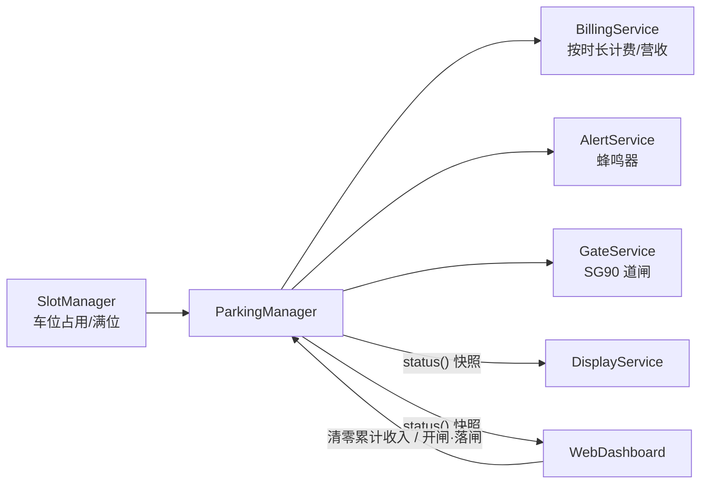
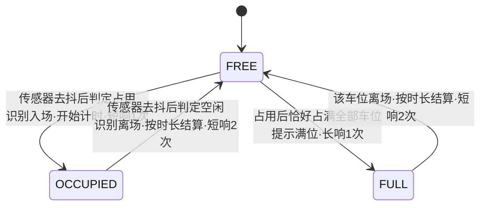

# 软件架构

## 设计原则

- `parking-system.ino` 只做初始化与调度，不写业务逻辑
- 每个硬件/功能一个模块（类），单一职责，便于答辩讲解与维护
- 全部 `millis()` 非阻塞调度，主循环无长 `delay()`
- GPIO 唯一来源 `config/Pins.h`，参数唯一来源 `config/Settings.h`
- 任一 `ENABLE_*` 功能开关关闭后仍可编译（条件编译退化为空实现）

## 本期方案

红外车位识别 + 车位管理 + 按时长计费 + SG90 出入口道闸（无 RFID）：车辆进出由
每个车位的红外避障传感器判定——车位由空闲变占用即识别为车辆入场并开始计时，
由占用变空闲即识别为离场并按停留时长结算费用；进 / 出场都联动道闸自动抬杆，
保持数秒后自动落杆（另有网页手动开 / 落）。计费**仅为本地计算与展示**，
不接任何真实支付。

## 模块职责

| 模块 | 文件（src/） | 职责 |
| --- | --- | --- |
| `SlotManager` | SlotManager.h/.cpp | 2~4 路红外车位去抖、total/occupied/free 统计、满位判断 |
| `ParkingManager` | ParkingManager.h/.cpp | 主业务：识别车辆进出、触发计费、产生状态快照 |
| `BillingService` | BillingService.h/.cpp | 按停留时长计费（整数「分」运算）、营收/停车次数/最近记录统计 |
| `AlertService` | AlertService.h/.cpp | 蜂鸣器节奏（入场 1 短 / 离场 2 短 / 满位 1 长 / 报警循环预留） |
| `GateService` | GateService.h/.cpp | 出入口道闸 SG90（LEDC PWM 驱动，非阻塞抬杆 + 定时自动落杆） |
| `DisplayService` | DisplayService.h/.cpp | OLED SSD1306 状态显示 |
| `WebDashboard` | WebDashboard.h/.cpp | Wi-Fi（STA + AP 兜底）、网页仪表盘、JSON API、清零收入接口 |
| `ParkingTypes` | ParkingTypes.h | 共享枚举（AlertPattern）、车位/停车记录/状态快照结构、金额与时长格式化助手 |

## 数据流



输入只产出事实（车位占用状态），决策集中在 `ParkingManager`：它跟踪每个车位的
占用变化、记录入场时刻、在离场时调用 `BillingService` 结算费用。OLED 和 Web 是
只读消费者（Web 的"清零累计收入"由 `ParkingManager` 转发到 `BillingService`
清零营收，并同时把在场车辆的入场计时重置为当前时刻）。

## 业务流程（车位事件驱动）



每个车位独立维护"空闲 / 占用"两态，由 `SlotManager` 去抖后给出。
`ParkingManager` 监听各车位的状态翻转：

- **空闲 → 占用**：记录入场时刻 `_enterMs[i]`，蜂鸣器 `ENTER`（短响 1 次），
  消息 `P2 in - timing started`；若此次占用恰好占满全部车位，则改用 `FULL`
  （长响 1 次），消息 `P2 in - Parking FULL`
- **占用 → 空闲**：以 `now - _enterMs[i]` 为停留时长调用 `BillingService::recordSession`
  结算费用，蜂鸣器 `EXIT`（短响 2 次），消息形如 `P2 left 03:12  1.50`
- **进 / 出场都触发道闸**：`GateService::open()` 抬杆放行，`GATE_OPEN_HOLD_MS` 后由
  `GateService::update()` 自动落杆；网页 `/api/gate` 另可手动开 / 落（ENABLE_GATE 控制）

## 计费模型

实现于 `BillingService`，参数全部来自 `config/Settings.h`：

- 停留时长 ≤ 免费时长（`PARKING_FREE_PERIOD_SEC`，默认 60 秒）→ 费用 0
- 否则应付分钟数 = `ceil(停留时长 / 60s)`，费用 = 应付分钟 × 每分钟单价
  （`PARKING_RATE_PER_MIN_CENTS`，默认 50 分 = ¥0.50/min）
- 金额一律用整数「分」运算，避免浮点误差，展示时换算成「元.角分」
  （OLED 用纯数字，网页/JSON 拼上 `CURRENCY_SYMBOL`）
- 累计总收入、停车次数实时累加；最近 `MAX_SESSION_LOG`（默认 5）条停车记录
  以环形缓冲保留，`recent(0)` 为最新一条

## 状态快照结构

`ParkingManager::status()` 产生只读的 `ParkingStatus`（定义见 `ParkingTypes.h`），
供 OLED 与 Web 消费：

| 字段 | 含义 |
| --- | --- |
| `totalSlots` / `occupiedSlots` / `freeSlots` | 总 / 已占用 / 剩余车位数 |
| `slotOccupied[i]` | 第 i 个车位是否占用 |
| `slotDurationMs[i]` | 占用车位的当前停留时长（毫秒），空闲为 0 |
| `totalRevenueCents` | 自启动/重置以来累计收入（分） |
| `sessionCount` | 已结算的停车次数 |
| `recent[]` / `recentCount` | 最近若干条停车记录（车位号 / 时长 / 费用），`recent[0]` 最新 |
| `gateOpen` | 出入口道闸是否抬起（ENABLE_GATE=0 时恒为 false） |
| `lastMessage` | 最近一条系统事件消息（纯 ASCII，OLED 与 Web 共用） |
| `uptimeMs` | 运行时间（毫秒） |

## 主循环调度顺序

```
loop():
  now = millis()
  1. 输入采集   slotManager.update          # 红外车位去抖
  2. 业务决策   parkingManager.update       # 识别进出 + 触发计费
  3. 执行输出   alertService.update / gateService.update / displayService.update / webDashboard.update
```

全程无阻塞点：车位采集只是 `digitalRead` + 时间比较，计费是纯整数运算，
蜂鸣器节奏、OLED 刷新、Web 服务都按 `millis()` 周期推进，对彼此响应无影响。

## 目录结构

```
firmware/parking-system/
├── parking-system.ino      # 仅初始化 + 调度
├── config/
│   ├── Pins.h              # 全部 GPIO（唯一来源）
│   ├── Settings.h          # 全部参数与功能开关（唯一来源）
│   └── WifiCredentials.example.h   # Wi-Fi 凭据模板（真实文件被 git 忽略）
├── src/                    # 各功能模块（Arduino 约定的 src 子目录会被编译）
└── web/dashboard.html      # 网页源文件（参考副本，实际内嵌在 WebDashboard.cpp）
```

## Phase 2 扩展点

- 火焰/烟雾报警：引脚已预留（GPIO 27 / 36），`AlertPattern::ALARM` 节奏已就位，
  新增 `SafetyService` 即可接入
- 风扇联动：GPIO 16 预留
- 进出场计数与数据持久化：在 `BillingService` 之上累计进出场次数、把营收/记录
  落到 NVS/SPIFFS
- 计费逻辑单元测试：`BillingService::computeFeeCents` 是纯函数，可直接在主机端
  测试（见 tests/README.md）
